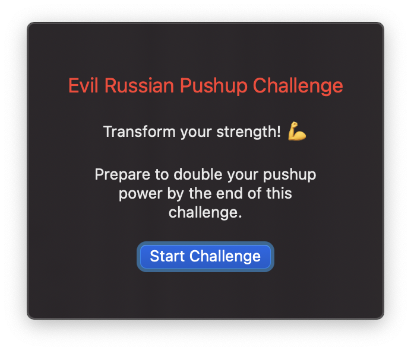
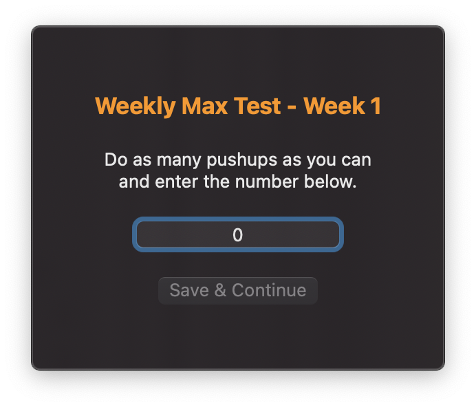
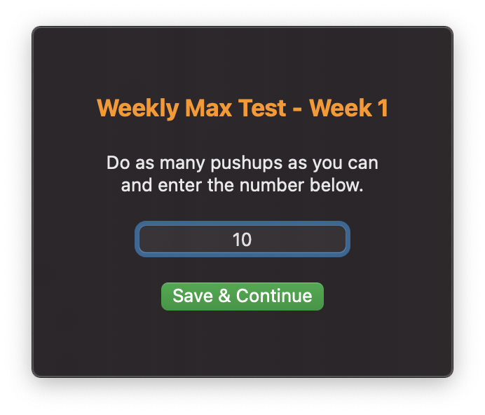
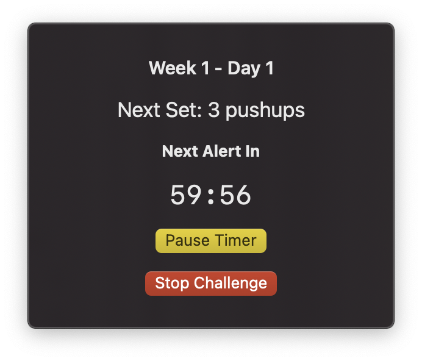
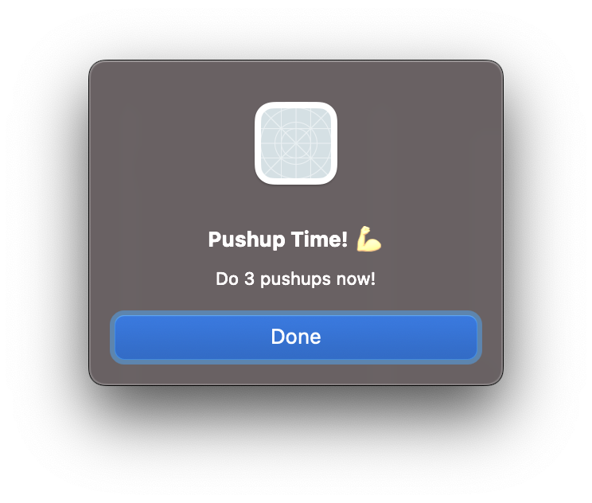

# Evil Russian Pushup Challenge – macOS Menu Bar App

## Overview
This lightweight macOS menu bar app helps users complete the **Evil Russian Pushup Challenge** by tracking progress, setting daily goals, and sending timely reminders. Designed for simplicity, the app runs in the background and is accessible from the menu bar with a minimal yet functional interface.

## Features
- **Max Pushup Test** – Users can input their max pushups to generate a structured challenge plan.
- **Daily Pushup Goals** – The app calculates the required sets and reps based on the challenge routine.
- **Reminders & Notifications** – Customizable alerts remind users when it’s time to complete their pushup sets.
- **Minimal Resource Usage** – Runs efficiently in the background without unnecessary distractions.

## Installation
1. Download the latest release from the repository.
2. Move the app to the Applications folder.
3. Launch the app and grant necessary notification permissions.

## Usage
1. Click the menu bar icon to open the app.
2. Enter your max pushups to generate a custom challenge plan.
3. Follow the daily pushup goals and complete the sets.
4. Receive reminders to stay on track.

## Screenshots

  
  
  
  
  

